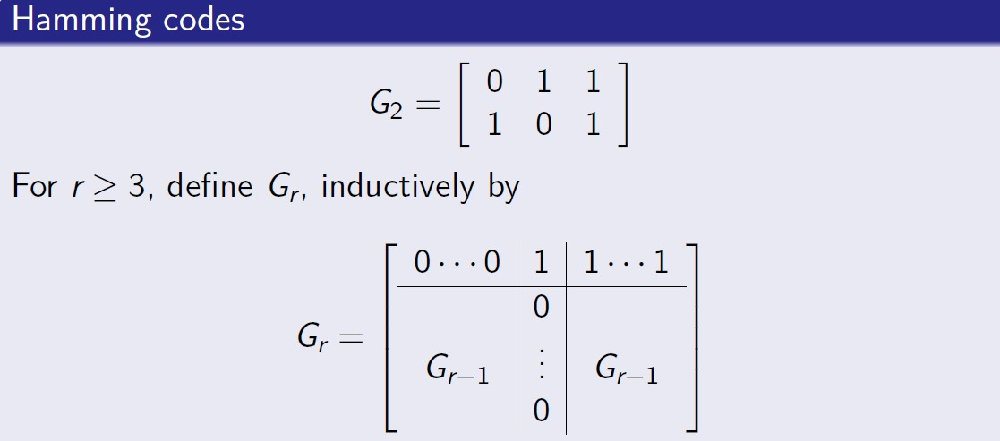

# Coding-Theory-Projects

This repository contains a detailed implementation of the Syndrome decoding method, which can be found in the `Syndrome Decoding.ipynb` file. 

It also contains an implementation of the Hamming Code, using an iterative approach. It can be found the `Recursive Hamming Code.ipynb` file.

## Syndrome Decoding

Syndrome decoding is a method used to detect and correct errors in linear block codes. The idea behind syndrome decoding is to use the **syndrome**, which is a product of the received vector and the parity-check matrix of the code. The syndrome is calculated as:

$`s = r \cdot H^T`$

where $`r`$ is the received message and $`H`$ is the parity-check matrix. If the syndrome $`s`$ is the zero vector, no error is detected. However, if the syndrome is non-zero, an error has occurred and can potentially be corrected. Each possible error pattern has a unique syndrome, which is precomputed and stored in a lookup table, allowing for quick error correction by mapping syndromes to error patterns. Depending on the **minimum Hamming distance** Certain syndromes can only be used to detect errors and cannot perform error correction.

## Hamming Codes + Recursive Calculation Method

Hamming codes are a type of error-correcting code designed to detect and correct single-bit errors. They follow the structure $`[2^m - 1, 2^m - m - 1]`$, where $`m`$ is the number of parity bits. Hamming codes are constructed by placing parity bits at strategic positions in the message. These parity bits check certain positions in the code to detect and correct errors. 

A recursive method for calculating Hamming codes involves placing the parity bits iteratively:

  

Once the parity bits are computed, the code can detect and correct any single-bit error by using the same syndrome decoding technique.

## License
This project is licensed under the Apache 2.0 License - see the [LICENSE](LICENSE) file for details.
